*WaRP7: The IoT and Wearable Development Platform*

*Hardware User Manual*

*v0.4 +
 +
May 24, 2016*

*Table of Contents*

*LIST of FIGURES*

file:///C:\Users\CStiegman\Documents\WORK\Freescale\WaRP7\document\User%20Manual%20-%20WaRP7_HW_&_Linux_v0.1_05102016.docx#_Toc450659580[Figure
1 WaRP7 4]

link:#_Toc450659581[Figure 2 WaRP7 connected 5]

link:#_Toc450659582[Figure 3 CPU Board 7]

link:#_Toc450659583[Figure 4 IO Board 7]

link:#_Toc450659584[Figure 5 i,MX7S SoC Diagram 9]

link:#_Toc450659585[Figure 6 KingSton eMCP Block Diagram 9]

link:#_Toc450659586[Figure 7 MIPI-DSI connector 10]

link:#_Toc450659587[Figure 8 Touch Screen Interface 11]

link:#_Toc450659588[Figure 9 MIPI CSI connector 11]

link:#_Toc450659589[Figure 10 Murata 1DX module 12]

link:#_Toc450659590[Figure 11 Design implementation of 1DX 12]

link:#_Toc450659591[Figure 12 NFC circuitry 13]

link:#_Toc450659592[Figure 13 PF3000 Functional Block diagram 14]

link:#_Toc450659593[Figure 14 Freescale SGTL5000 Audio Codec 16]

link:#_Toc450659594[Figure 15 MPL3115A2 Block Diagram 16]

link:#_Toc450659595[Figure 16 Altimeter schematics 17]

link:#_Toc450659596[Figure 17 FXOS8700CQ – Accelerometer/Magnetometer
Block Diagram 17]

link:#_Toc450659597[Figure 18 Accelerometer/Magnetometer schematics 17]

link:#_Toc450659598[Figure 19 FXAS21002 Gyroscope Block Diagram 18]

link:#_Toc450659599[Figure 20 Gyroscope schematics 18]

[[introduction]]
Introduction
------------

[[platform-purpose]]
Platform Purpose
~~~~~~~~~~~~~~~~

The WaRP7 is the next generation Internet of Things (IoT) and Wearable’s
Reference Platform. WaRP7 is a powerful, low-cost platform designed for
rapid prototyping and reduces time to market. WaRP7 is optimized, comes
is a tiny form factor and yet flexible enough to offer all the
advantages of traditional development tools. It has been architected and
designed from the ground up to address key challenges in the IoT and
wearables markets, such as battery life, connectivity, user experience
and miniaturization. WaRP7 is based on the NXP i.MX 7Solo applications
processor that features an advanced implementation of the ARM®
Cortex®-A7 core, as well as the ARM® Cortex®-M4 core. It comes with
features such as on-board sensors, connectivity including NFC,
Bluetooth®, Bluetooth Smart and Wi-Fi® and on-board external LPDDR3
memory.

This document is intended as an introduction to the WaRP7 CPU Board and
IO Board hardware and focuses primarily on its initial setup and basic
usage.

[[kit-contents]]
Kit Contents
~~~~~~~~~~~~

In the box you will find the following items as shown in **Figure 1**.

• WaRP7 CPU Board

• WaRP7 IO Board

• Lithium Polymer Battery

• Quick Start Guide.

The display for the kit can be purchased
separately (__details coming soon__). Check for availability at
http://www.element14.com/warp7[www.element14.com/warp7]

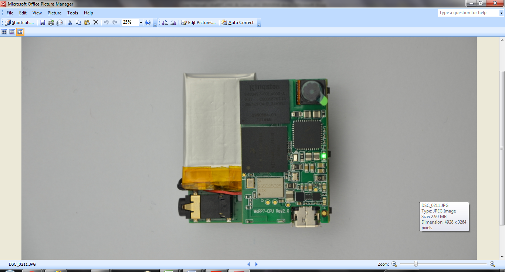

[[getting-started-with-hardware]]
Getting Started with Hardware +
^^^^^^^^^^^^^^^^^^^^^^^^^^^^^^^

* STEP 1: Connect NFC cables to IO board
+
image:media/image65.png[image]
* STEP 2: Connect CPU board

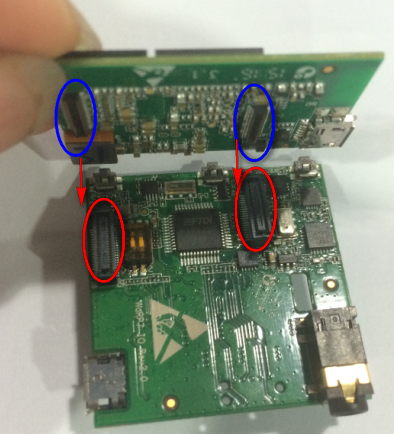

* STEP 3: Connect battery
+
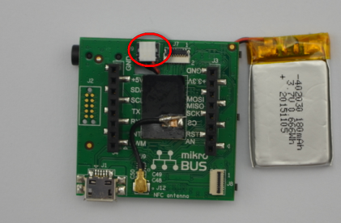
+
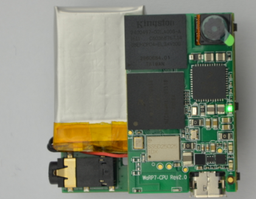
* STEP 4: Connect LCD
+
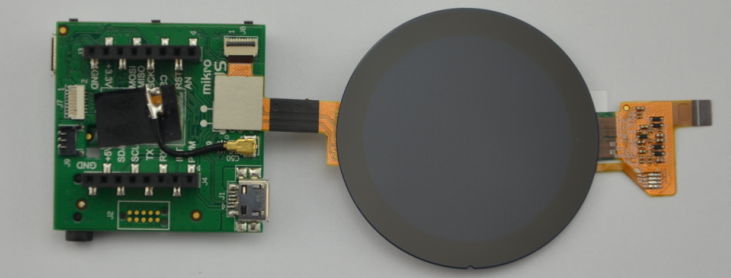
+
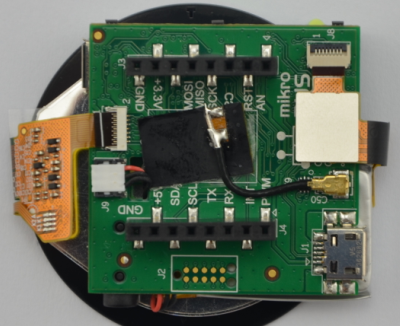
+
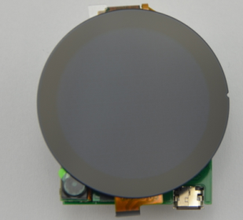

Connect USB

image:media/image72.png[image]

Figure 2 WaRP7 connected

[[warp7-hardware-overview]]
WaRP7 Hardware Overview
-----------------------

The WaRP7 is the next generation Wearable’s Reference Platform based on
the NXP iMX7 Solo applications processor.

The kit consists of 2 boards

* A *CPU board* featuring the ARM Cortex-A7 based iMX7 processor,
memory, power management and a combo WiFi/BLE module.
* An *IO board* which provides interface to variety of sensors,
expansion and debugging capabilities.

[[featuresspecifications]]
Features/Specifications
~~~~~~~~~~~~~~~~~~~~~~~

[cols="",options="header",]
|================================================================
|*Features*
|*CPU Board*
|*Processor* a|
NXP iMX7S

ARM Cortex-A7/Cortex-M4

|*Memory* |8GB, 8bit Embedded MMC/ 512MB LPDDR3
|*PMIC* |PF3000 PMIC and BC3770 battery charger.
|*Wireless* |Combo WiFI/BLE
|*Display/Camera interface* a|
MIPI-DSI connector

MIPI-CSI connector

|*Power Source* |USB/Battery
|*PCB* |38mm x 23mm |10 layers
|*Indicators* |1-Power, 1 – User
|*IO Board*
|*Debug Support* |JTAG, Serial Header
|*Sensors* |Accelerometer, Magnetometer Pressure Sensor Gyroscope
|*Audio* |Stereo codec – Mic In / Line Out
|*Expansion* |MikroE Click header
|================================================================

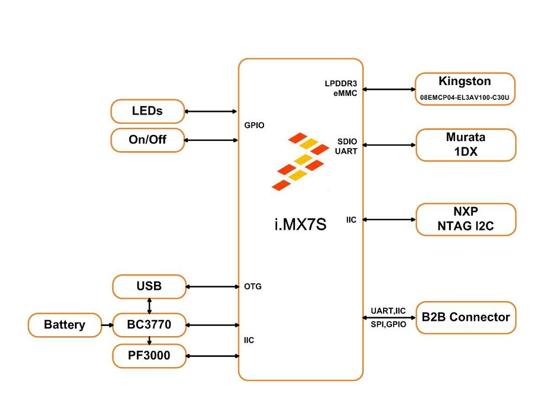

Figure 3 CPU Board

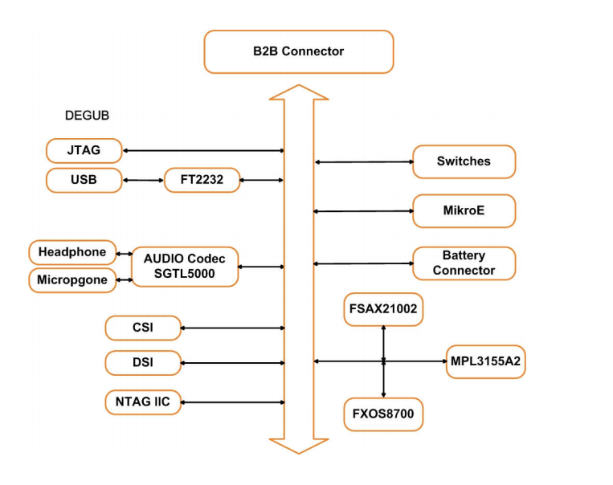

Figure 4 IO Board

[[board-dimension-and-operating-environment]]
Board Dimension and Operating Environment
~~~~~~~~~~~~~~~~~~~~~~~~~~~~~~~~~~~~~~~~~

**Table 1 WaRP7 CPU Board Dimensions**

[cols=",",options="header",]
|=====================
|Length |38 mm
|Width |23 mm
|PCB Thickness |1.0 mm
|=====================

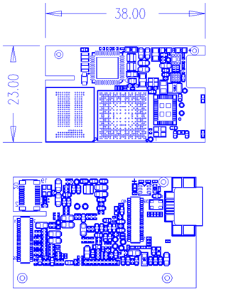

The board operates in the commercial temperature range, 0°C ~ 85°C

*Table 2 WaRP7 IO Board Dimensions*

[cols=",",options="header",]
|=====================
|Length |38 mm
|Width |38 mm
|PCB Thickness |1.0 mm
|=====================

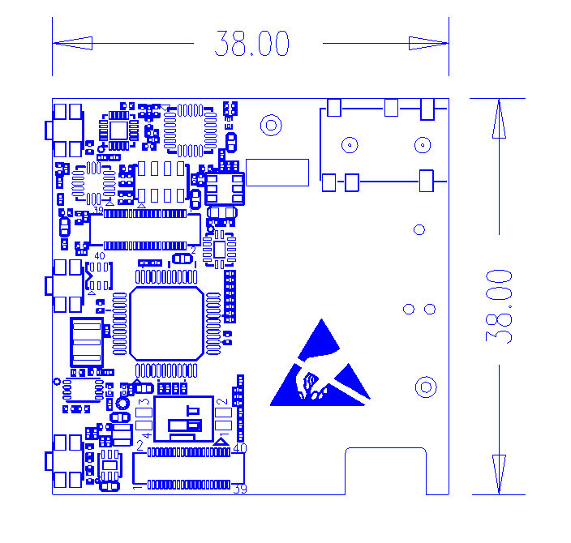

[[hardware-overview]]
Hardware Overview
-----------------

[[cpu-board]]
CPU Board
~~~~~~~~~

[[cpu]]
CPU
^^^

Main Processor: NXP MCIMX7S3DVK08SA - i.MX7S with 12mm x 12mm MAPBGA,
0.4mm

The i.MX7S applications processor houses an ARM Cortex-A7 core and an
ARM Cortex-M4. The device is targeted for IoT, Wearable and general
embedded markets.

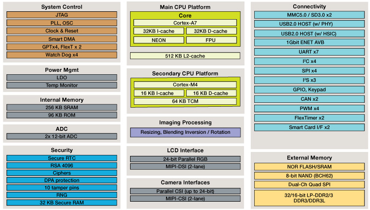

Figure 5 iMX7S SoC Diagram

[[memory-emcp-lpddr3-and-emmc]]
Memory eMCP – LPDDR3 and eMMC
^^^^^^^^^^^^^^^^^^^^^^^^^^^^^

The CPU Board features a Multi-Chip Package Memory
08EMCP04-EL3AV100-C30U from Kingston which combines 8GB eMMC and 512MB
Low Power DDR3 synchronous dynamic RAM. This comes in 221-ball FBGA
package.

image:media/image78.png[image]

Figure 6 KingSton eMCP Block Diagram

[[video-and-display]]
Video and Display
^^^^^^^^^^^^^^^^^

The WaRP7 CPU board provides output video from MIPI-DSI and accepts
input through MIPI- CSI

[[mipi-dsi]]
MIPI-DSI
++++++++

The CPU board includes a MIPI-DSI connector for outputting output the
video from the i.MX7S MIPI- DSI PHY via the MIPI-DSI interface.

image:media/image79.png[image]

Figure 7 MIPI-DSI connector

[[capacitive-touch-screen]]
Capacitive Touch Screen
+++++++++++++++++++++++

Capacitive touch screen is supported by I2C via touch screen port.

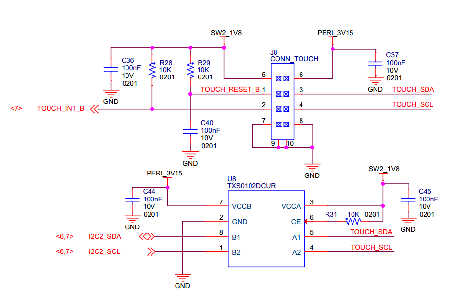

Figure 8 Touch Screen Interface

[[mipi-csi]]
MIPI-CSI
++++++++

The CPU board includes a MIPI-CSI camera connector for connecting a CSI
camera module.

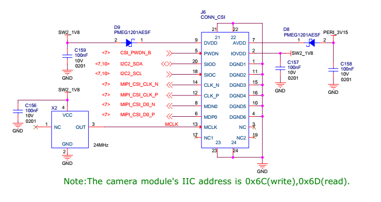

Figure 9 MIPI CSI connector

[[connectivity]]
Connectivity
^^^^^^^^^^^^

The WaRP7 board will provide a number of connectivity include Wi-Fi,
Bluetooth, Bluetooth (BLE), and USB-OTG. There will be provision for NFC
as a passive tag primarily for Bluetooth pairing.

[[wi-fibluetooth]]
Wi-Fi/Bluetooth
+++++++++++++++

The Murata Type 1DX module is an ultra-small module that includes 2.4GHz
WLAN IEEE

802.11b/g/n and Bluetooth Version 4.1 plus EDR functionality. Based on
Broadcom BCM4343W, the module provide high-efficiency RF front end
circuits.

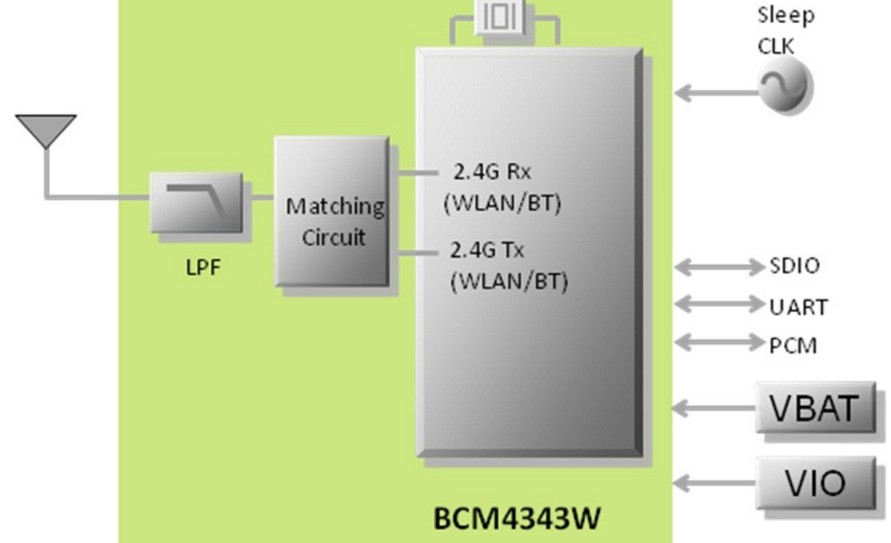

 +
Figure 10 Murata 1DX module

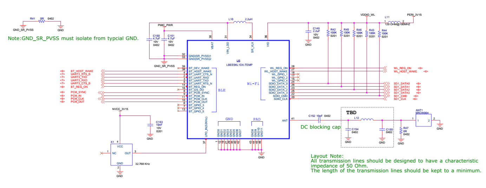

Figure 11 Design implementation of 1DX

[[usb-otg]]
USB-OTG
+++++++

The CPU board provides a USB micro-AB connector to support USB-OTG
function powered by the by USB OTG1 module on i.MX7S.

[[nfc]]
NFC
+++

The board provides support for NFC using the NXP NT3H1101W0FHK. In
addition to the passive NFC Forum compliant contactless interface, the
IC features an I2C contact interface, which can communicate with i.mx7
if NTAG I2C is powered from an external power supply. An additional
externally powered SRAM mapped into the memory allows a fast data
transfer between the RF and I2C interfaces and vice versa, without the
write cycle limitations of the EEPROM memory.

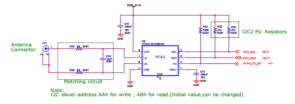

Figure 12 NFC circuitry

[[power-management]]
Power Management
^^^^^^^^^^^^^^^^

[[power-management-ic]]
Power Management IC
+++++++++++++++++++

The NXP PF3000 power management integrated circuit (PMIC) features a
configurable architecture that supports numerous outputs with various
current ratings as well as programmable voltage and sequencing. This
enables the PF3000 to power the core processor, external memory and
peripherals to provide a single-chip system power solution.

image:media/image85.jpeg[image]

Figure 13 PF3000 Functional Block diagram

[[power-tree-design]]
Power Tree Design
+++++++++++++++++

The usage of PF3000 output is as shown in Table 6 below.

*Table 2 PF3000 Output Power Up Sequence and Usage*

[cols=",,,,",options="header",]
|=======================================================================
a|
*PF0300*

*Channel*

 |*Voltage* |*Power up sequence* a|
*Output*

*Current*

 |*i.MX7 Power Rail*
|SW1A |1.15 V |1 |1000 mA |VDD_ARM

|SW1B |1.15 V |1 |1750 mA |VDD_SOC

|SW2 |1.8 V |2 |1250 mA a|
VDDA_1P8_IN FUSE_FSOURCE VDD_XTAL_1P8

VDD_ADC1_1P8

VDD_ADC2_1P8

VDD_TEMPSENOR_1P8

|SW3 |1.5 V |3 |1500 mA |NVCC_DRAM NVCC_DRAM_CKE

|VSNVS |3.0 V |0 |1 mA |VDD_SNVS_IN

|SWBST | |- |600 mA |

|VREFDDR | |3 |10 mA |DRAM_VREF

|VLDO1 |1.8 V |2 |100 mA |VDD_LPSR_IN

|VLDO2 |1.2 V |- |250 mA |

|VLDO3 |1.8 V |2 |100 mA |NVCC_GPIO1/2

|VLDO4 |1.8 V |- |350 mA |

|V33 |3.15 V |2 |350 mA |NVCC_xxx VDD_USB_OTG1_3P3_IN
VDD_USB_OTG2_3P3_IN

|VCC_SD |3.15 V |3 |100 mA |NVCC_SD2
|=======================================================================

The following i.MX7S power rails must use the internal LDO outputs.

*Table 3 iMX7S Power Rails – Internal LDO*

[cols=",",options="header",]
|=================================================
|*i.MX7S internal LDO output* |*i.MX7S Power Rail*
|VDDD_1P0_CAP a|
VDD_MIPI_1P0

PCIE_VP PCIE_VP_RX PCIE_VP_TX

|VDDA_PHY_1P8 a|
VDDA_MIPI_1P8

PCIE_VPH PCIE_VPH_RX PCIE_VPH_TX

|VDD_1P2_CAP |USB_VDD_H_1P2
|=================================================

[[battery-charger]]
Battery Charger
+++++++++++++++

The NXP BC3770 is a fully programmable switching charger with dual-path
output for single-cell Li-Ion and Li-Polymer battery. The dual-path
output allows mobile applications with a fully discharged battery to
boot up the system.

* High efficiency and switch-mode operation reduces heat dissipation and
allows for higher current capability for a given package size
* Single input with a 20V withstanding input and charges the battery
with an input current up to 2A
* Charging parameters and operating modes are fully programmable over an
I2C Interface that operates up to 400 kHz
* Highly integrated featuring OVP and Power FETs
* Supports 1.5 MHz switching capabilities

[[io-board]]
IO Board
~~~~~~~~

[[audio]]
Audio
^^^^^

The IO board includes the Freescale SGTL5000 – a ultra-low power audio
codec with MIC In and Line Out capability.

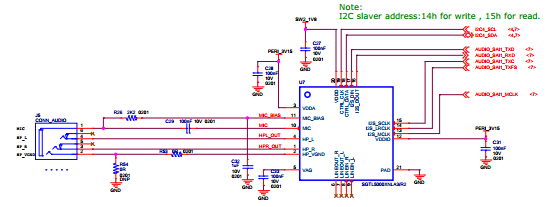

Figure 14 Freescale SGTL5000 Audio Codec

[[sensors]]
Sensors
^^^^^^^

The WaRP7 board will include three sensors: altimeter, accelerometer and
gyroscope. These three sensor chips share the I2C bus on i.MX7S. The
sensors interrupts are wired to the processor as OR circuit. The
software will determine which device asserted the interrupt.

[[altimeter]]
Altimeter
+++++++++

The board features NXP’s MPL3115A2 precision altimeter. The MPL3115A2 is
a compact piezoresistive absolute pressure sensor with an I2C interface.
MPL3115 has a wide operating range of 20kPa to 110 kPa, a range that
covers all surface elevations on Earth. The fully internally compensated
MEMS in conjunction with an embedded high resolution 24-bit equivalent
ADC provide accurate pressure [Pascals]/altitude [meters] and
temperature [degrees Celsius] data.

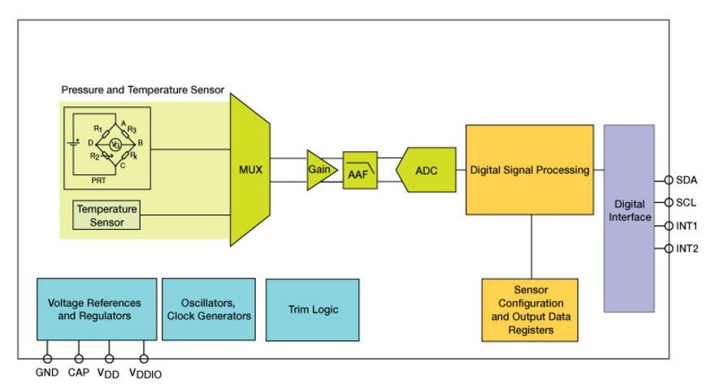

Figure 15 MPL3115A2 Block Diagram

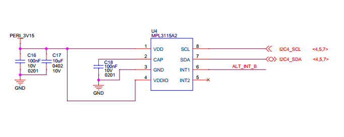

Figure 16 Altimeter schematics

[[accelerometer-and-magnetometer]]
Accelerometer and Magnetometer
++++++++++++++++++++++++++++++

The board also features FXOS8700CQ 6-axis sensor combines
industry-leading 14-bit accelerometer and 16-bit magnetometer sensors in
a small 3 x 3 x 1.2 mm QFN plastic package.

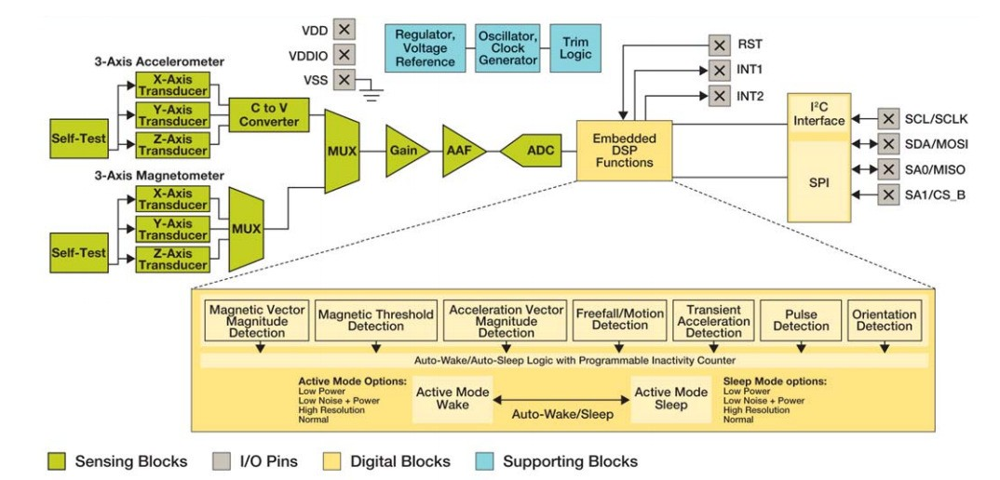

Figure 17 FXOS8700CQ – Accelerometer/Magnetometer Block Diagram

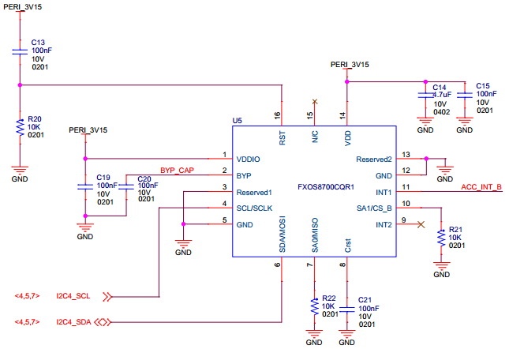

Figure 18 Accelerometer/Magnetometer schematics

[[gyroscope]]
Gyroscope
+++++++++

The IO board also features the NXP’s 3-axis digital gyroscope -
FXAS21002.

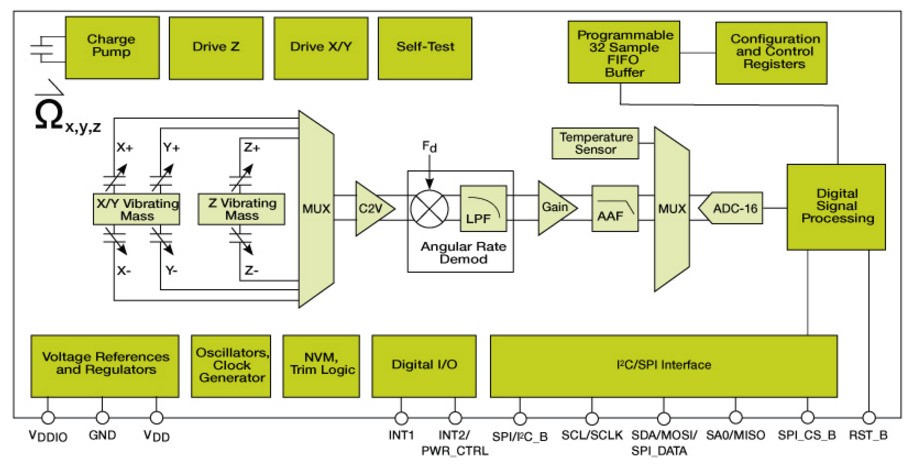

Figure 19 FXAS21002 Gyroscope Block Diagram

image:media/image92.png[image]

Figure 20 Gyroscope schematics

[[peripheral-expansion-port]]
Peripheral Expansion Port
^^^^^^^^^^^^^^^^^^^^^^^^^

The board provides expansion headers compatible with the *mikroBUS^TM^*
socket connection standard for accessing the following communication
modules on i.MX7S:

* I2C
* SPI
* PWM
* UART
* GPIO

[[linux-software]]
Linux Software
--------------

*Note:*

command shown with prefix *$* are to be run on host machine (like ubuntu
etc.)

command shown with prefix *=>* are to be run on uboot prompte

command shown with prefix *~#* are to be run on board after linux up.

[[compilation]]
Compilation
~~~~~~~~~~~

===========================

*Steps:*

\1. Extract the kernel and use the below commands to compile

$ make ARCH=arm CROSS_COMPILE=arm-linux-gnueabihf- distclean

$ make ARCH=arm CROSS_COMPILE=arm-linux-gnueabihf- warp7_defconfig

$ make ARCH=arm CROSS_COMPILE=arm-linux-gnueabihf- zImage

$ make ARCH=arm CROSS_COMPILE=arm-linux-gnueabihf- modules

$ make ARCH=arm CROSS_COMPILE=arm-linux-gnueabihf-
imx7d-warp7-mipi-dsi.dtb

\2. Extract and compile imx_usb_loader-master

\3. usb imx_usb, to load uboot first time in the board.

$ cd imx_usb_loader-master

$ make

$ ./imx_usb u-boot.imx

\4. u-boot prompt will come. ( we are using minicom )

\5. Run on uboot

=> ums 0 mmc 0

\6. Now you will able to see emmc of as storage device on your computer.

\7. Use any standard utility to make partition table.

\8. create 3 partitions (10MB(Fat32), 100MB(Fat32) and remaining space
as ext4)

\9. copy zImage to to the 100MB fat32 partition.

10.rename and copy *imx7d-warp7-mipi-dsi.dtb* as *warp7.dtb* to the
100MB fat32 partition.

\11. copy the *rootfs_debian.tar.bz2* to the 3rd ext4 partition.

\12. now install kernel modules to the rootfs as shown below.

$ *sudo make ARCH=arm CROSS_COMPILE=arm-linux-gnueabihf- modules_install
INSTALL_MOD_PATH=/path_to_your_emmc_ext4_partition_mount*

\13. now unmount the partitions using "**sudo umount /dev/sdX**"
command.

\14. in u-boot prompt, hit **Ctrl+c**, to cancel the mounted mmc.

\15. in u-boot prompt, use *loadx* command to load *uboot* to ram.

after loadx completed , press **ctrl+a**, then s to select xmodem for
uboot transfer.

=> loadx

. save the uboot in emmc.

=> mmc write 0x80800000 2 0x2a6

*<CAUTION>*

\16. now fuse the OTP. This command is one time only, be careful else it
will brick the board .

=> fuse prog 1 3 10002820

\17. set bootcmd environment params as below .

=> *setenv bootcmd 'setenv mmcroot /dev/mmcblk2p3 rootwait rw;setenv
bootargs console=$\{console},$\{baudrate} root=$\{mmcroot};mw 30330218
0;fatload mmc 0:2 0x80800000 zImage;fatload mmc 0:2 0x83000000
warp7.dtb;bootz 0x80800000 - 0x83000000'*

=> *saveenv*

=> *run bootcmd*

Now linux must be up and running.

\18. using NET OVER USB, we build USB ethernet build as **module**.

use below commands on the board to load the modules.

Note: using static IP in your host system. We are using as below in
*/etc/network/interfaces*

*192.168.7.10, *

*255.255.255.0, *

*192.168.7.1*

~# insmod /lib/modules/4.1.15/kernel/drivers/usb/gadget/libcomposite.ko

~# insmod
/lib/modules/4.1.15/kernel/drivers/usb/gadget/function/u_ether.ko

~# insmod
/lib/modules/4.1.15/kernel/drivers/usb/gadget/function/usb_f_rndis.ko

~# insmod
/lib/modules/4.1.15/kernel/drivers/usb/gadget/legacy/g_ether.ko

~# ifup usb0

[[testing]]
Testing
~~~~~~~~

===========================

[[testing-audio]]
Testing Audio:
^^^^^^^^^^^^^^

*======================================================*

listen audio from warp7:

place an audio file (ex: input.wav) file in home directory,and run below
command:

*~#* *aplay input.wav *

record audio usingwarp7:

run below command, it will record audio file with 10 secs duration .

*~#* *arecord -d 10 output.wav *

to change volume control of headphone:

below example shows to change volume to 100%

*~# amixer set 'Headphone' 100%*

to change gain control of mic:

below example shows to change gain control to 100%

*~# amixer set 'Mic' 100%*

*Testing Battery Charger:*

*======================================================*

compile & run the "bc3770.c" from the utils folder.

image:media/image93.png[image]

[[testing-sensors]]
Testing Sensors:
^^^^^^^^^^^^^^^^

*======================================================*

The mpl3115a2 sensor consists of Pressure and Altimeter.

The FXOS8700CQR1 sensor consists of Acclerometer and Magnetometer.

The FXAS21002CQR1 sensor consists of Gyrometer:

run "i2cdetect" command to scan i2c bus for devices.

*UU* shows devices already binded to platform/drivers.

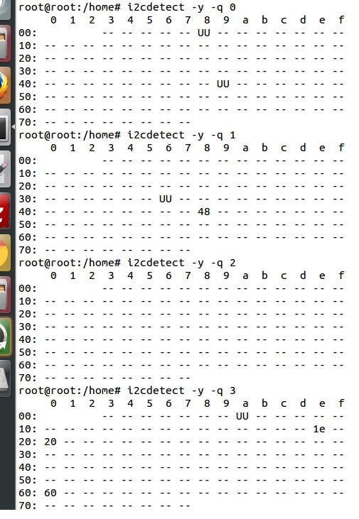

To detect sensor identity status we will check for "**WHOAMI**" register
values:

execute below commands in terminal:

*mpl3115a2:*

*~#* i2cget -y 3 0x60 0x0C

*0xc4*

MPL3115A2 datasheet confirms the "WHOAMI" value.

*FXOS8700CQR1*

**~#**i2cget -y 3 0x1e 0x0D

*0xc7*

FXOS8700CQR1 datasheet confirms the "WHOAMI" value.

*FXAS21002CQR1*

$i2cget -y 3 0x20 0x0C

*0xd7*

FXAS21002CQR1 datasheet confirms the "WHOAMI" value.

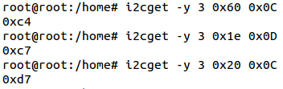

With above detection we can confirm the sensor hardware is working.

sample codes "detect_acclerometer.c","detect_gyrometer.c" and
"detect_mpl3115.c" confirm the same.

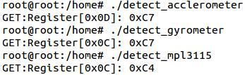

we developed a simple bare-metal application in Linux to access mpl3115
sensor.

the same can be done for android/yocto platforms .

the code "**mpl3115_temperature.c**" can be compiled and tested to get
temperature values.

you will get result as below (with debug enabled):

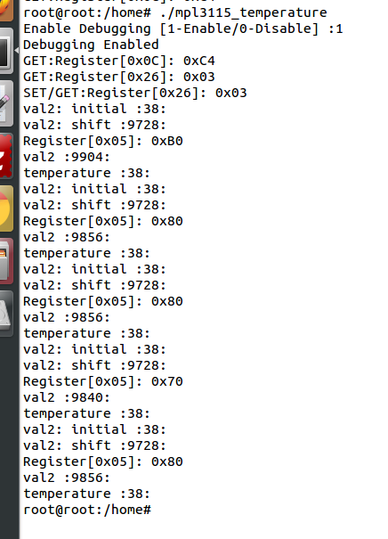

(note: the code access */dev/i2c-3* interface, if *MPL3115A2* driver
enabled in kernel, the code will fail due to device blocking by driver)

With testing part over, we can proceed to further development using
kernel supported drivers.

enable the supported drivers in kernel by setting the below values to
"**y**" in *.config* or "**make menuconfig**":

*# CONFIG_SENSORS_FXOS8700 is not set*

*# CONFIG_SENSORS_FXAS2100X is not set*

*# CONFIG_INPUT_MPL3115 is not set*

to

*CONFIG_SENSORS_FXOS8700=y*

*CONFIG_SENSORS_FXAS2100X=y*

*CONFIG_INPUT_MPL3115=y*

applications need to be written from android/debian/yocto interfaces to
access full functionality.

[[testing-wifi]]
Testing Wifi:
^^^^^^^^^^^^^

*======================================================*

broadcom bcmdhd getting loaded and wireless interface getting up suring
kernel boot.

this comes from enabling "**Broadcom FullMAC wireless cards support** "
in kernel source "Device Drivers >> Network Device Support > Wireless
Lan"

the firmware supporting "**BCM4339** " hardware is available in
"**/lib/firmware/bcm**" directory.

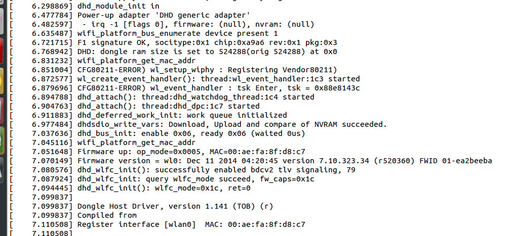

automatic ip allocation using DHCP:

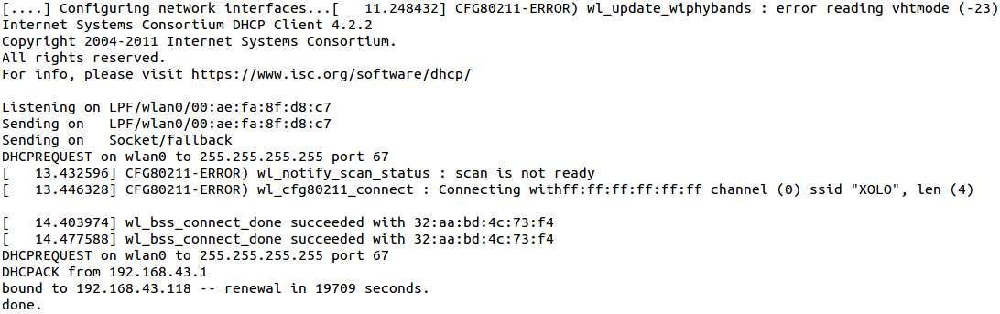

Verify ip address:

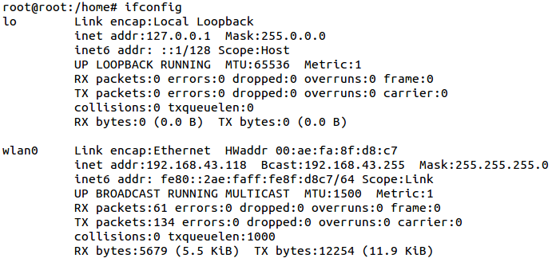

Ping test:

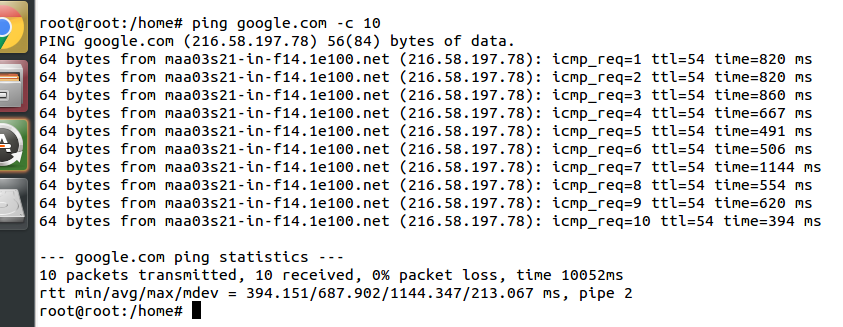

change setting for *essid* & *password* in "/etc/network/interfaces"
file.

===========================================

auto lo

iface lo inet loopback

auto wlan0

iface wlan0 inet dhcp

wpa-ssid "SSID_NAME"

wpa-psk "PASSWORD"

===========================================

wpa_supplicant config *"/etc/wpa_supplicant.conf"*

===========================================

ctrl_interface=/var/run/wpa_supplicant

ctrl_interface_group=0

update_config=1

network=\{

ssid=" SSID_NAME "

scan_ssid=1

key_mgmt=WPA-PSK2

psk=" PASSWORD "

priority=5

}

===========================================

[[testing-lcd]]
Testing LCD:
^^^^^^^^^^^^

After boot up , goto /root/lcd and run the following command:

./framebuffer.out

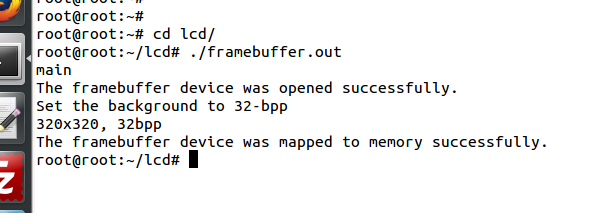

It will starts the following sequence of displays.

image:media/image103.png[image]

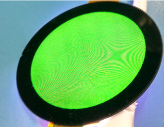

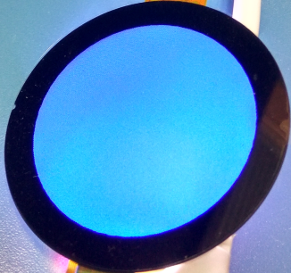

image:media/image106.png[image]

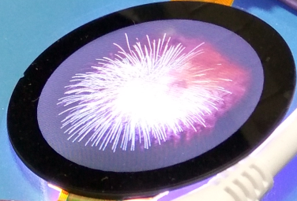

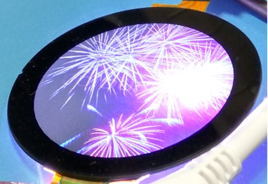

image:media/image109.png[image]
